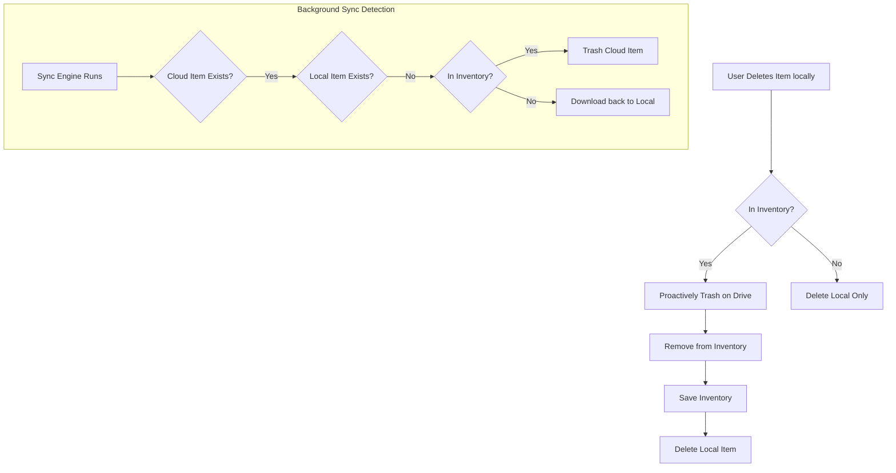

# Implementation Report - Sync Hardening & Dynamic Island Navigation
Date: 2026-04-23

## Summary
1.  **Dynamic Island Navigation**: Enabled navigation to the Project Notes page by tapping the sync status badge.
2.  **Deletion Sync Hardening**: Resolved issues where local deletions were not propagating to the cloud, causing files to "re-appear" during sync.

## Changes

### 1. Dynamic Island Interaction
- **CanvasDynamicIsland.dart**: Wrapped the `_buildSyncStatus` widget in a `GestureDetector`.
    - **Action**: Tapping the sync status badge now navigates the user to `/projects/notes`.
    - **UX**: Added `HapticFeedback.mediumImpact()` for tactile confirmation.

### 2. Proactive Cloud Deletion
- **DocumentationBlock.dart**:
    - **Immediate Trashing**: Updated `deleteFile` and `deleteFolder` to check if the item exists in the `_syncInventory`. If a cloud mapping is found, the item is proactively trashed on Google Drive before the local deletion completes.
    - **Folder Tracking**: Fixed a bug where only files were tracked in the inventory. Folders are now correctly mapped (`localPath` -> `remoteId`), ensuring folder deletions are also synced.
    - **Inventory Persistence**: Guaranteed inventory updates and saves after every manual deletion.

## Logic Flow (Deletion Sync)

## Impact
- **Navigation**: Improved accessibility to project management during long sync operations.
- **Data Consistency**: Deletions are now "sticky." Once a file is deleted in the app, it is removed from the cloud, preventing the "zombie file" effect where old documents were re-downloaded.
