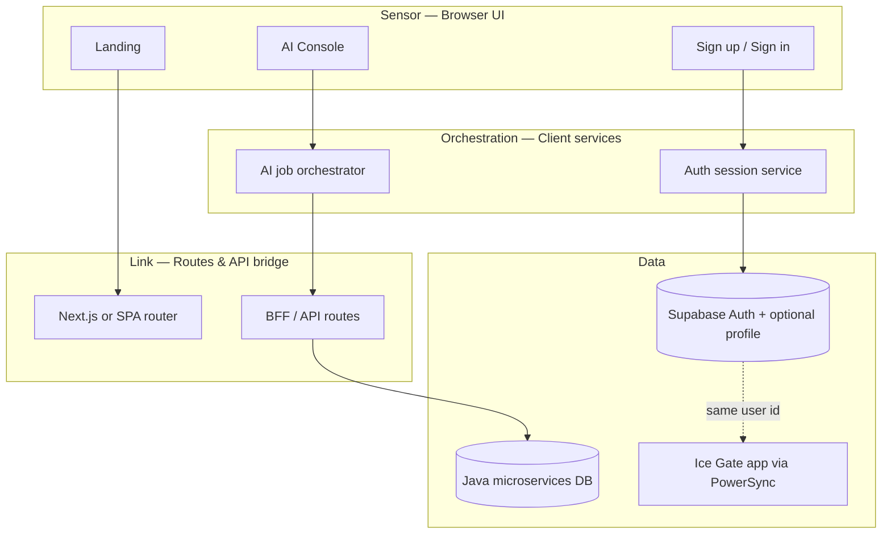

# DesignForm — DuyLong Web

> **Mục đích file:** Brief + wireframe + form copy-paste cho **vibe coding** (AI build từng slice, không dump cả app một lần).  
> **Liên kết:** Ice Gate mobile (`ice_gate`), [four_layer_architecture](file:///Users/duylong/Code/AI_Knowledge/DuyLongSkills/.cursor/skills/DuyLongSkills/architecture/four_layer_architecture.md), [API.md](../API/API.md).

**Last updated:** 2026-05-29

---

## 1. Product brief

| Field | Value |
|-------|--------|
| **Product name** | DuyLong Web |
| **One-liner** | Web gateway: đăng ký / đăng nhập cho app **Ice**, và cổng quản lý **dịch vụ AI** (Java microservices). |
| **Primary users** | Người dùng Ice mới (onboarding web), admin/dev (AI jobs, keys, usage). |
| **Platform** | Web (responsive; desktop-first cho admin, mobile-friendly cho auth). |
| **Language** | UI: VI + EN; code/comments: EN. |
| **Out of scope (v1)** | Thay thế toàn bộ Ice Gate Flutter app; billing phức tạp; custom model training UI. |

---

## 2. Goals

### User-facing

1. **Đăng ký / đăng nhập Ice** — email, Google, Apple (cùng identity với app qua Supabase).
2. **Onboarding sau signup** — tải app, deep link, hoặc QR về TestFlight / store.
3. **AI services** — gọi / theo dõi các agent (food vision, skills, chat, …) qua backend Java; không expose DB trực tiếp ra browser.

### Technical

1. **4 layer** — giữ discipline giống Ice Gate (sensor / link / orchestration / data).
2. **Auth tách biệt data AI** — Supabase Auth + JWT; AI state & logs trên Postgres/Java services.
3. **Vibe coding** — mọi feature mới đi qua form §7 trước khi code.

---

## 3. Architecture (4 layers — Web)



| Layer | Web responsibility | Không làm gì ở đây |
|-------|-------------------|-------------------|
| **Sensor** | Pages, forms, glass/ice visual, loading/error states | Gọi Java DB trực tiếp; business rules |
| **Link** | Routes, middleware auth, proxy `/api/*` → `BACKEND_URL` | Tính điểm, gamification |
| **Orchestration** | Session, token refresh, map DTO ↔ UI, queue AI requests | SQL queries |
| **Data** | Supabase client (auth only hoặc thin profile); HTTP tới Java | UI rendering |

**Gợi ý stack (chưa chốt — điền khi vibe code slice 1):**

- Framework: Next.js App Router *hoặc* Vite + React (chọn một).
- Auth: `@supabase/ssr` hoặc `supabase-js` + secure cookies.
- Style: tokens từ [duylongart_glass_ui](file:///Users/duylong/Code/AI_Knowledge/DuyLongSkills/.cursor/skills/DuyLongSkills/ui/duylongart_glass_ui.md) (dark, glass, neon accent).

---

## 4. Infrastructure

| Concern | System | Notes |
|---------|--------|--------|
| **Sign up / Sign in** | **Supabase Auth** | Cùng project với Ice Gate (`SUPABASE_URL`, anon key). JWT dùng cho app + web. |
| **Profile / sync app** | Supabase + PowerSync | Web chỉ cần avatar/display name nếu có; chi tiết life data ở app. |
| **AI workloads** | **Java microservices** + DB riêng | Food agent, custom `/backend/*`, `/api/v1/*` — xem [API.md](../API/API.md). |
| **Object / media** | `backend.duylong.art` object URLs | Avatar, uploads — không lưu blob trong Supabase (trừ khi sau này đổi). |
| **Secrets** | Server env only | `SUPABASE_SERVICE_ROLE` (BFF), `BACKEND_URL`, agent URLs — không vào client bundle. |

**Luồng auth (happy path):**

```text
Browser → Supabase signUp/signIn → access_token
       → BFF validates JWT
       → Java APIs (Bearer supabase token hoặc exchanged service token — chốt khi implement)
       → Response → Orchestration → UI
```

---

## 5. Screens & features (wireframe — vẽ tay OK)

### 5.1 Landing `/`

```text
┌─────────────────────────────────────────────┐
│  [Ice logo]              [EN|VI] [Sign in]  │
├─────────────────────────────────────────────┤
│                                             │
│     Gateway to your Life Orchestration      │
│     [ Get started ]  [ Download Ice app ]   │
│                                             │
│     ┌─────┐ ┌─────┐ ┌─────┐                 │
│     │Focus│ │Notes│ │ AI  │  ← 3 pillars    │
│     └─────┘ └─────┘ └─────┘                 │
└─────────────────────────────────────────────┘
```

### 5.2 Sign up `/auth/sign-up`

```text
┌──────────────────┐
│ Create Ice account│
│ email            │
│ password         │
│ [ Continue ]     │
│ ─── or ───       │
│ [ Google ] [Apple]│
│ Already have? In │
└──────────────────┘
```

### 5.3 Sign in `/auth/sign-in`

Giống sign-up; thêm **Forgot password** → Supabase reset email.

### 5.4 Post-auth welcome `/welcome`

```text
┌────────────────────────────────┐
│ You're in, {name}              │
│ [ Open Ice on this device ]    │  ← deep link / store
│ [ Go to AI Console ]           │  ← role admin hoặc feature flag
└────────────────────────────────┘
```

### 5.5 AI Console `/ai` (protected)

```text
┌─────────────────────────────────────────────┐
│ AI Console          [user] [sign out]       │
├──────────┬──────────────────────────────────┤
│ Services │  Food vision    [Run test]       │
│ History  │  Skills API     [Status: ok]     │
│ Keys     │  Custom agent   [Configure]      │
├──────────┴──────────────────────────────────┤
│ Recent jobs table (id, service, status, ts) │
└─────────────────────────────────────────────┘
```

**Feature checklist v1:**

- [ ] Landing + marketing copy
- [ ] Supabase sign-up / sign-in / sign-out
- [ ] Protected route middleware
- [ ] Welcome + deep link tới app
- [ ] AI Console: list services từ Java health/status endpoint
- [ ] AI Console: submit one test job (e.g. food URL analyze) và hiện kết quả JSON

---

## 6. Data contracts (draft)

| UI needs | Source | Endpoint / table |
|----------|--------|------------------|
| Session user | Supabase | `auth.getUser()` |
| Profile image | Java / object store | `GET /api/v1/users/me` (Bearer Supabase JWT) |
| AI service list | Java BFF | *TBD* — ví dụ `GET /api/v1/ai/services` |
| Run AI job | Java | *TBD* — ví dụ `POST /api/v1/ai/jobs` body `{ serviceId, payload }` |

Điền endpoint thật khi backend có spec; đừng đoán schema DB Java từ web.

---

## 7. AI Vibe Coding Form (copy-paste)

Dùng form này **mỗi lần** bạn nhờ AI build một slice. Thay `[...]` rồi paste vào chat.

```markdown
# DesignForm slice

## Meta
- Product: DuyLong Web
- Ref doc: context/DESIGN/DuyLongWeb_DesignForm.md
- Slice name: [e.g. Sign-in page shell]
- Platform: Web
- Stack: [Next.js 15 / Vite+React — pick one]

## Purpose (1 paragraph)
[Mục đích slice này — ví dụ: Trang đăng nhập Supabase, chưa nối AI.]

## Success looks like
- [ ] …
- [ ] …

## Out of scope this slice
- [ ] …

## Architecture mapping
| Layer | What to add |
|-------|-------------|
| Sensor | [pages/components] |
| Link | [routes, middleware] |
| Orchestration | [auth service, hooks] |
| Data | [Supabase only / Java proxy] |

## UI spec
- Screen: [§5.2 Sign in]
- Style: Glass & Ice, dark, accent #…
- Copy VI: …
- Copy EN: …

## Integrations
- Supabase: [signInWithPassword / OAuth provider]
- Java API: [none | endpoint + method]

## Build rules (DuyLongSkills)
1. Plan only first — list files, no code until I say "build"
2. One slice per turn (`improve_little`)
3. Match four_layer_architecture — no business logic in page components
4. Env: document new vars in .env.example

## Prompt for agent
@context/DESIGN/DuyLongWeb_DesignForm.md
multi_short_prompt — Plan only: [slice name]. List files and phases. No code.
```

**Sau khi approve plan:**

```text
@context/DESIGN/DuyLongWeb_DesignForm.md
improve_little — Build phase 1 only: [slice name]. [Specific file or component].
```

---

## 8. Suggested build order (vibe coding)

| # | Slice | Layers touched |
|---|--------|----------------|
| 1 | Repo scaffold + env + glass tokens | Sensor shell |
| 2 | Landing static | Sensor |
| 3 | Sign-up / sign-in Supabase | Sensor + Link + Orch + Supabase |
| 4 | Auth middleware + `/welcome` | Link + Orch |
| 5 | BFF proxy stub → `BACKEND_URL` | Link + Data |
| 6 | AI Console empty + nav | Sensor |
| 7 | AI service status + one test job | Orch + Java |

Mỗi hàng = **một conversation turn** (hoặc một PR nhỏ).

---

## 9. Open decisions (fill before slice 5+)

| # | Question | Your answer |
|---|----------|-------------|
| 1 | Next.js vs Vite? | |
| 2 | Host domain? (`web.duylong.art`?) | |
| 3 | Java nhận Supabase JWT trực tiếp hay exchange token? | |
| 4 | AI Console: ai được vào (all users vs admin)? | |
| 5 | Monorepo với `icegate` hay repo riêng? | |

---

## 10. Related docs

- [PROJECT_CONTEXT.md](../PROJECT_CONTEXT.md) — Ice Gate mobile
- [API.md](../API/API.md) — `BACKEND_URL`, Supabase, agents
- [FoodAI.md](../PROTOCOLS/FoodAI.md) — ví dụ AI agent contract
- DuyLongSkills: `purpose_to_code.md`, `multi_short_prompt.md`, `improve_little.md`
