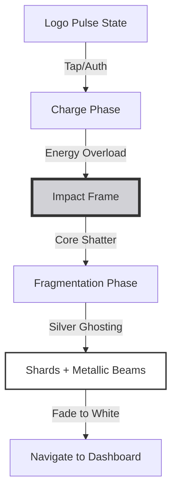

# Implementation Report - Silver Elegance Redesign
**Date:** 2026-04-20
**Task:** Redesign the entry page "cracker" for premium monochromatic silver excellence.

## Flowchart of Logic

## Key Changes
1.  **Pure Silver Palette**: Implemented `platinumSilver`, `mercurySilver`, and `polishedSteel` to create a rich monochromatic experience.
2.  **Metallic Ghosting**: Replaced prismatic refraction with multi-tonal silver offsets, giving shards a liquid-metallic persistence.
3.  **Silver Glimmer Fractures**: `GlassCrackPainter` now traces jagged cracks with high-brightness silver glimmers.
4.  **Mercury Shockwave**: Transformed the expansion ring into a liquid-silver "Mercury Surge" using arctic silver gradients.
5.  **Silver Metallic Background**: Switched from obsidian to a `silverMetallicGradient` on the entry page for a cohesive metallic theme.
6.  **Density Boost**: Maintained the high particle density (400 large shards, 650 dust) for a powerful, jewelry-grade impact.

## Files Modified
- [entry_constants.dart](file:///Users/duylong/Code/Flutter/icegate/lib/ui_layer/animation_page/components/entry_constants.dart)
- [prism_entry_page.dart](file:///Users/duylong/Code/Flutter/icegate/lib/ui_layer/animation_page/prism_entry_page.dart)
- [prism_painters.dart](file:///Users/duylong/Code/Flutter/icegate/lib/ui_layer/animation_page/components/prism_painters.dart)

## Insights
- Using multiple passes of the same path with different colors and small offsets is a highly efficient way to simulate high-end chromatic aberration in Flutter's `CustomPainter` without complex shader boilerplate.
- Scaling particle count requires careful management of `RepaintBoundary` to maintain 60/120fps during the explosion.
