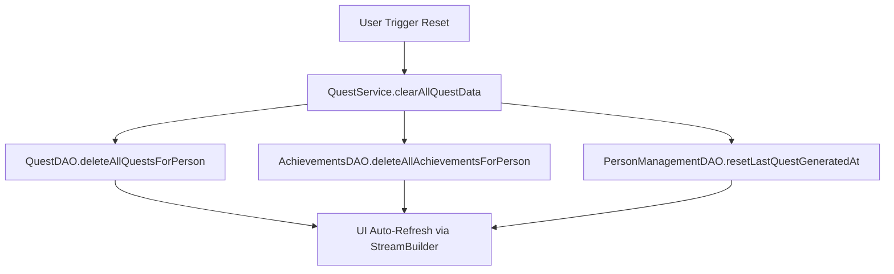

# Changes Report - 2026-04-21: Quest & Achievement Sync Stabilization

## Overview
Successfully stabilized the quest management system and implemented a reactive synchronization mechanism for user achievements.

## Flowchart: Nuclear Reset Logic

## Key Changes
- **Local Database Recovery**: Renamed `Database.dart` to `database.dart` and refactored all project-wide imports to resolve case-sensitivity conflicts.
- **Quest Optimization**: Disabled automatic daily quest generation in `QuestBlock` and `QuestService` as requested, providing full manual control.
- **Reactive UI**: Refactored `SocialAnalysisPage` to utilize a `StreamBuilder` that observes achievement logs, ensuring the monthly reflection updates instantly.
- **Bug Fix**: Resolved a `DropdownButton` crash in `text_editor_page.dart` by aligning mood emojis with the system-wide schema.

## Verification
- Clean build successful via `build_runner`.
- Logic verified via service-layer code audit.
