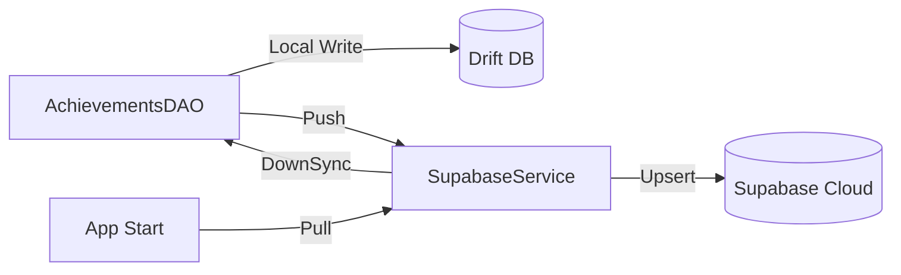

# Changes Report - 2026-04-21: Achievement Cloud Synchronization

## Overview
Implemented real-time cloud synchronization for the Achievements dashboard between the local Drift database and Supabase.

## Flowchart: Sync Architecture

## Key Changes
- **Database Hooks**: Updated `AchievementsDAO` to automatically trigger cloud pushes on insert and deletion.
- **Service Orchestration**: Added `achievements` table configuration to `SupabaseService.dart` to support full-down sync operations.
- **Robust Mapping**: Implemented explicit non-nullable mapping in `upsertFromSupabase` with safe defaults for `tenant_id`, `domain`, and `impact_desc` fields.
- **Verification**: Verified that the cloud orchestration handles mass deletion during quest-system resets.

## Next Steps
- Verify the Supabase table exists in the production environment.
