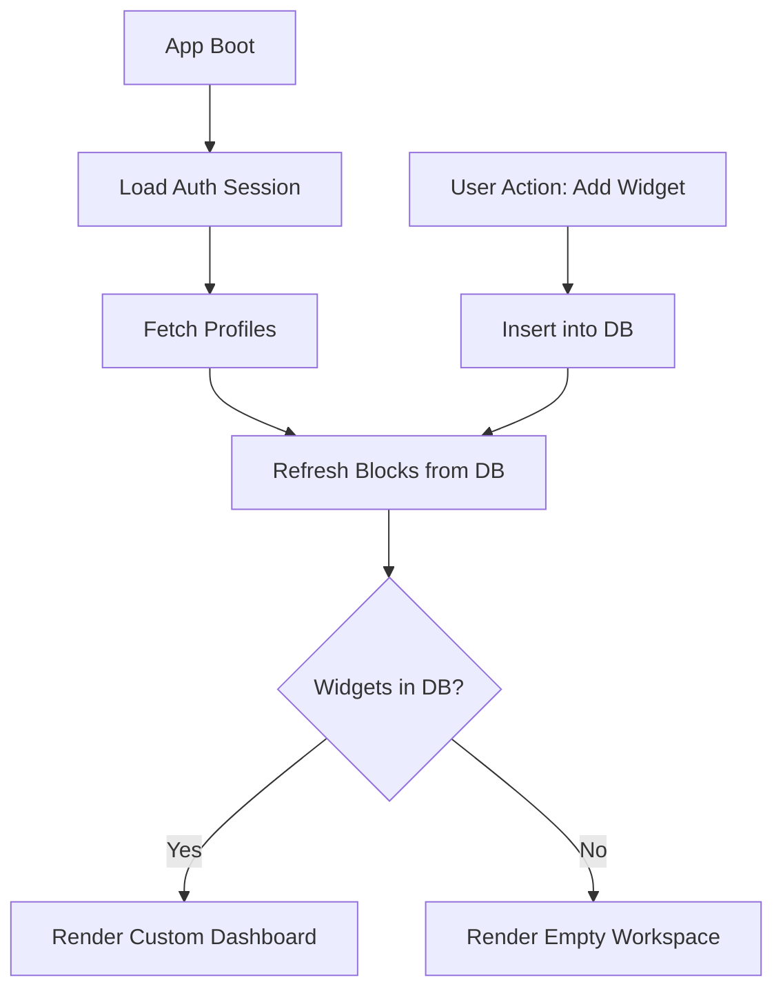

# Changes Report - 2026-04-21: Internal Widget Seed Removal

## Overview
Removed all automated "seeding" of internal widgets (plugins) from the application startup flow to allow for user-driven workspace management.

## Key Changes
- **RoutingLayer.dart**: Excised the logic block in `_initAsyncDatabaseLink` that injected `WidgetPage`, `Health Department`, `Block Reminder`, `Social Blocker`, and `ICE GATE SSH` widgets into the local database if missing.
- **HomePage.dart**: Removed the `_seedPlugins` method which used to automatically insert the `UPLINK` terminal on every boot.
- **Data Integrity**: Preserved all manual widget addition paths (dialogs and forms), ensuring users can still customize their dashboards as expected.

## Flowchart: New Dashboard Initialization

