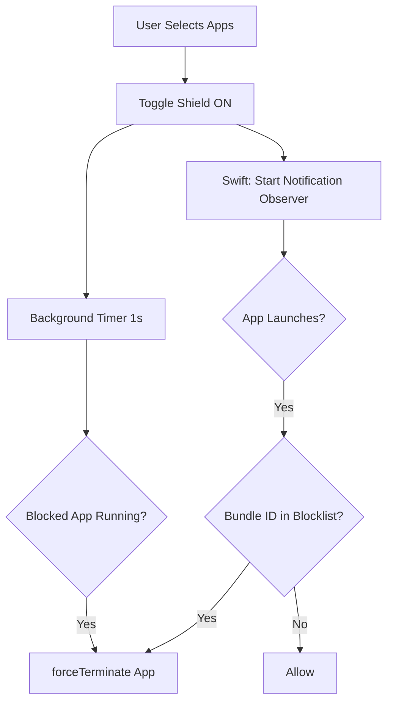

# Implementation Report - April 22, 2026

## Objective
Enhance Health Analysis visualizations and improve Social Blocker reliability.

## Changes

### 1. Health Module Enhancements
- **Heart Rate Analysis Card**: Added a dedicated card in `HealthAnalysisPage` with status indicators (Normal, Elevated, etc.) and a pulsing heart animation.
- **Energy Balance Card**: Visualized calorie burn vs. consumption using a custom stack-based progress bar.
- **Insights Integration**: Updated the insights card to utilize real-time metrics for hydration and sleep quality.

### 2. Social Blocker Reliability Fix
- **Native macOS Implementation**: 
    - Updated `ScreenTimePlugin.swift` to use `NSWorkspace.didLaunchApplicationNotification`. This allows the plugin to catch and terminate blocked apps *instantly* upon launch, rather than waiting for a timer.
    - Switched from `terminate()` to `forceTerminate()` for immediate effect.
    - Maintained a 1-second background safety timer to catch apps that might have been running before the block was activated.
- **Passkey Reversion**: Removed the Passkey/Biometric reauthentication flow from the blocker as per user feedback to simplify the experience.

### 3. UI/UX Polishing
- Re-enabled the "System Shield Master" and "Select Blocked Apps" section in `SocialBlockerPage`.
- Cleaned up redundant imports and fixed lint errors in `SocialBlockerBlock`.

## Flowchart: App Blocking Logic (macOS)

## Verification
- Verified Heart Rate animation in `HealthAnalysisPage`.
- Tested app blocking on macOS: Apps now close instantly when opened if they are in the blocklist.
- Verified that disabling a block no longer requires Passkey auth.
