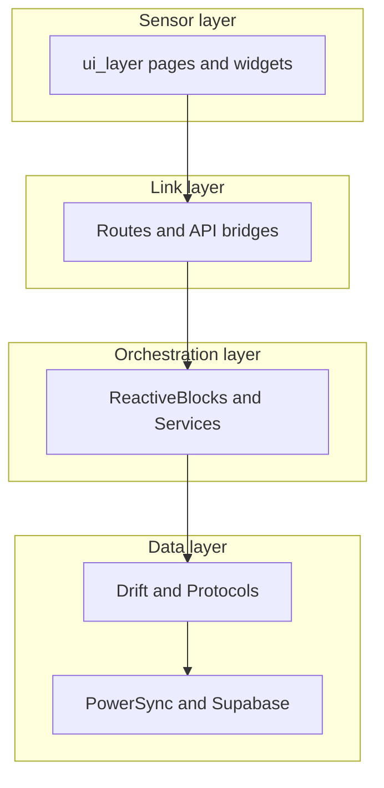

# Ice Gate — Project Context

> **Purpose of this file:** Single reference for AI agents and developers — app purpose, technical approach, documentation map, and functional areas. Update when major architecture or product direction changes.

**Last updated:** 2026-05-24

---

## 1. Purpose

**Ice Gate** (`ice_gate`) is a **personal productivity and life-orchestration** Flutter app.

### Core (product focus)

- **Time management:** focus sessions, timers, routines.
- **Notes-first productivity:** projects as notebooks, synced rich notes (`flutter_quill`).

### Extended pillars (hub model)

Health, social, and finance are **optional hubs** connected to the core — not separate siloed apps.

### Vision (Life Orchestration Engine)

From [`ARCHITECTURE.md`](ARCHITECTURE/ARCHITECTURE.md): Ice Gate acts as a **“Gateway to Hubs”** — a central place that:

- Aggregates data from health (e.g. Apple Health), social, finance, and career/project sources.
- **Gamifies** real-world progress into **Quest Points (XP)** and a holistic score balance.
- Helps users visualize daily life progress with minimal navigation.

**One-line:** Focus + notes at the center; health, social, and finance as connected modules on a customizable dashboard.

---

## 2. Technique (how it is built)

### Platform & stack

| Area | Technology |
|------|------------|
| Framework | **Flutter** (SDK `^3.9.2`); primary delivery iOS (TestFlight) |
| State | **`signals` / `signals_flutter`** + **`provider`**; UI rebuilds via `Watch` |
| Routing | **`go_router`** — [`lib/link_layer/ui_route/InternalRoute.dart`](../lib/link_layer/ui_route/InternalRoute.dart) |
| Local DB | **`drift`** (SQLite), offline-first |
| Cloud sync | **`powersync`** → **Supabase** (selective sync when user enrolls in a hub) |
| Auth | Supabase, custom Java backend (`BACKEND_URL`), Google / Apple sign-in, **passkeys** |
| Models / API | **Freezed**, **json_serializable**, **Retrofit** + **Dio** |
| Rich content | **flutter_quill**, **media_kit**, **audio_service** |
| Health & device | **health**, **pedometer**, device calendar, local notifications |
| Integrations | Google APIs, SSH (`dartssh2` + `xterm`), WebViews, MinIO/S3-compatible storage |
| UI aesthetic | Material + custom themes; Glass & Ice / cyberpunk-inspired JSON themes |

### Bootstrap

```
main.dart → DataLayer → ThemeLayer → MaterialApp.router
```

Environment: copy `.env` from `.env.example` before `flutter run`.

### Four-layer architecture

Actual `lib/` layout (see also DuyLongSkills `four_layer_architecture.md`):

| Layer | Path | Responsibility |
|-------|------|----------------|
| **Sensor** | `lib/sensor_layer/` | UI (`ui_layer/`), touch/keyboard input, presentation |
| **Link** | `lib/link_layer/` | Routes, deep links, bridges between UI and orchestration |
| **Orchestration** | `lib/orchestration_layer/` | `ReactiveBlock`s, services, business logic, gamification |
| **Data** | `lib/data_layer/` | Drift DAOs, protocols, cloud hubs (Supabase, PowerSync, Google) |



### Engineering discipline

1. **Local-first:** Write to Drift; let PowerSync sync to Supabase. Avoid direct Supabase CRUD except auth or explicit bypass.
2. **Plugin model:** New features = Protocol (`data_layer`) → ReactiveBlock (`orchestration_layer`) → UI widget registerable on Canvas or department page.
3. **Thin UI:** `build()` reads signals; logic stays in ReactiveBlocks. Prefer signals over `setState`.
4. **Dynamic home:** [`DragCanvas`](../lib/sensor_layer/ui_layer/canvas_page/DragCanvas.dart) — internal widgets + external WebView widgets.

### Maintenance & AI workflow

- Refer to [`ARCHITECTURE.md`](ARCHITECTURE/ARCHITECTURE.md) for plugin protocol, state rules, and review buffer after AI-generated changes.
- Broader knowledge: `/Users/duylong/Code/AI_Knowledge` and **DuyLongSkills** (see §3).
- Release: `.agent/workflows/`, `scripts/deploy_testflight.sh`.

---

## 3. Documentation map

### In-repo (`docs/`)

| Document | Contents |
|----------|----------|
| [`../README.md`](../README.md) | Quick start, Flutter commands |
| **This file** | Purpose, technique, doc index, feature areas |
| [`ARCHITECTURE/ARCHITECTURE.md`](ARCHITECTURE/ARCHITECTURE.md) | LOE vision, layers, maintenance, AI rules |
| [`ARCHITECTURE/DATABASE.md`](ARCHITECTURE/DATABASE.md), [`DatabaseSchema.md`](ARCHITECTURE/DatabaseSchema.md) | Schema and DB design |
| [`API/API.md`](API/API.md) | Env vars, backends, integrations |
| [`PROTOCOLS/`](PROTOCOLS/) | Points, Food AI, SSH, mindfulness/exercise, entry animation |
| [`GUIDES/`](GUIDES/) | Dev setup, Postgres testing |
| [`HISTORY/`](HISTORY/) | Archival change logs and analysis |
| [`.agent/workflows/`](../.agent/workflows/) | TestFlight, release, delivery cycle |
| [`.agents/rules/`](../.agents/rules/) | Code style, design patterns |

### DuyLongSkills (external, recommended for agents)

Path: `/Users/duylong/Code/AI_Knowledge/DuyLongSkills/`

| Topic | Location |
|-------|----------|
| Four-layer architecture | `.cursor/skills/DuyLongSkills/architecture/four_layer_architecture.md` |
| Glass & Ice UI | `.cursor/skills/DuyLongSkills/ui/duylongart_glass_ui.md` |
| Prototype → build workflow | `customer_requirements/`, `multi_short_prompt`, `improve_little` |
| Social & finance expansion | `dev/IceGate_Social_Finance_Arch_Plan.md` |
| Deployment | `workflow/deployment.md`, `dev/deploy_testflight.sh` |

---

## 4. Functional areas (by code location)

| Area | Path (under `lib/sensor_layer/ui_layer/`) | Role |
|------|-------------------------------------------|------|
| Home / Canvas | `canvas_page/`, `home_page/` | Customizable dashboard, plugin cards, shell |
| Projects | `projects_page/` | Notebooks, calendar, Quill notes |
| Health | `health_page/` | Metrics, food/calories, insights |
| Social | `social_page/` | Achievements, mind/focus trends, quests |
| Finance | `finance_page/` | Accounts, subscriptions, portfolio direction |
| Integrations | `integrations_page/` | Google Calendar, device calendar, hub |
| User / Auth | `user_page/` | Login, passkey, profile |
| Stock / environmental | `stock_page/`, `home_page/EnvironmentalPluginCards.dart` | Market, AQI-style plugins |
| Animation / entry | `animation_page/` | Prism entry and branded transitions |

Orchestration counterparts: `lib/orchestration_layer/ReactiveBlock/`, `lib/orchestration_layer/Services/`.

Data models: `lib/data_layer/Protocol/`, DAOs in `lib/data_layer/DataSources/local_database/`.

---

## 5. Key environment variables

See [`API/API.md`](API/API.md) for the full list. Common entries:

| Variable | Role |
|----------|------|
| `SUPABASE_URL`, `SUPABASE_ANON_KEY` | Supabase client |
| `POWERSYNC_URL` | PowerSync replica WebSocket |
| `BACKEND_URL` | Custom Java auth / account API |
| `FOOD_AGENT_URL` | Food vision / calorie agent |
| `S3_*` | Object storage (meals, media) |

---

## 6. Related reading order (for new contributors)

1. This file (`PROJECT_CONTEXT.md`)
2. [`ARCHITECTURE/ARCHITECTURE.md`](ARCHITECTURE/ARCHITECTURE.md)
3. [`API/API.md`](API/API.md)
4. Layer you are changing (sensor / link / orchestration / data)
5. Relevant [`PROTOCOLS/`](PROTOCOLS/) doc for the feature domain
